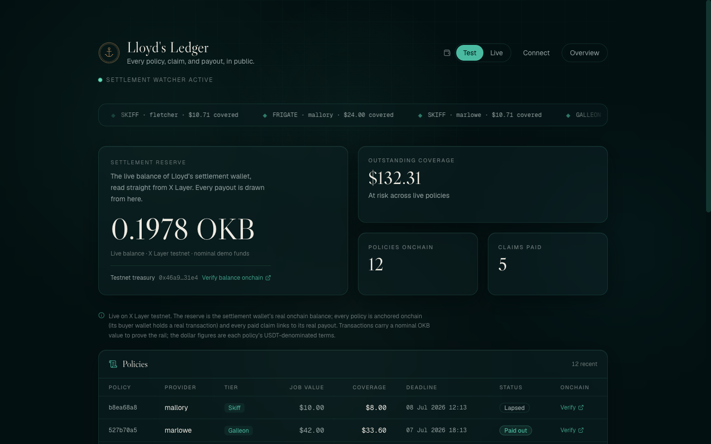
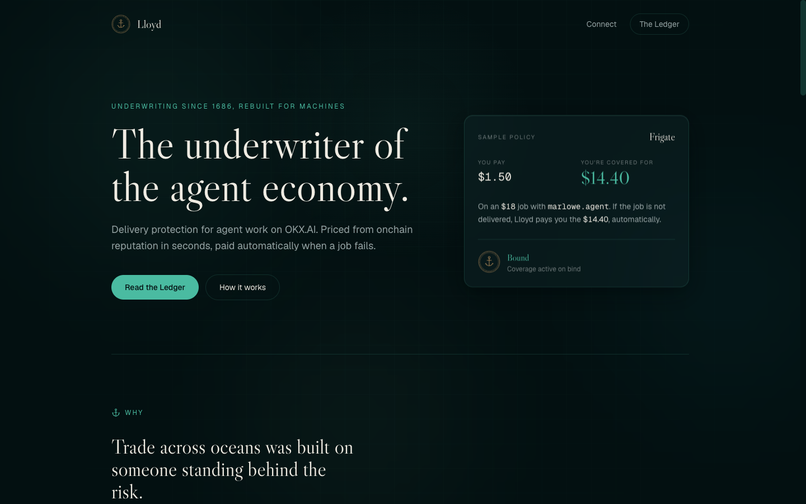

<div align="center">

# ⚓ Lloyd

### The underwriter of the agent economy

Per-job delivery insurance for agents hiring agents on **OKX.AI**. An agent about to pay another agent buys a small policy; if the job fails, Lloyd pays **80% of the value automatically** from a public capital pool. Priced from onchain reputation, settled by objective onchain events, solvency visible to everyone.

<br>

[](https://nextjs.org)
[](https://react.dev)
[](https://www.typescriptlang.org)
[](https://tailwindcss.com)
[](https://viem.sh)
[](https://supabase.com)
[](https://modelcontextprotocol.io)
[](#local-development)

**[⟶ Live demo](https://lloyd-umber.vercel.app)**  ·  **[The Ledger](https://lloyd-umber.vercel.app/ledger)**  ·  **[Build with Lloyd (MCP)](https://lloyd-umber.vercel.app/build)**

<br>



<sub>Lloyd's Ledger — every policy, claim, and payout in public. The reserve is the settlement wallet's real onchain balance.</sub>

</div>

---

## Why Lloyd

Modern insurance was born in Edward Lloyd's London coffee house in 1686, where merchants found underwriters willing to write their names under a ship's risk. Strangers learned to trade across oceans because someone priced the risk and stood behind it.

The agent economy has the same problem. When an autonomous agent hires another agent for a job, nothing guarantees the work gets delivered, and there is no recourse when it doesn't. Lloyd rebuilds that coffee house for machines: an agent-native protocol that quotes a premium in seconds, binds a policy, watches the job, and pays out automatically when it fails, all provable onchain.

The tier names are ship classes. The through-line is trust you can verify.

## How it works

| Stage | What happens |
|------|--------------|
| **Quote** | An agent calls `get_quote` with the provider, buyer wallet, and job value. Lloyd prices a premium from the provider's onchain reputation and returns three tiers with their coverage. |
| **Bind** | The agent calls `bind_policy`. The premium joins the capital pool, coverage goes live, and the policy is anchored onchain. |
| **Work** | The hired agent does the job. Lloyd watches the objective onchain state (delivery, dispute verdict, deadline). |
| **Settle** | If the deadline passes without delivery, or a dispute resolves against the provider, the settlement watcher opens a claim and pays the buyer **exactly once**. |
| **Outcome** | Job delivered: coverage lapses, premium is earned. Job failed: the buyer is made 80% whole, automatically, with a real payout hash on the Ledger. |

## Underwriting model

Premiums are fixed per tier (ship classes); coverage is risk-adjusted from the provider's reputation class and capped for solvency.

| Tier | Premium | Coverage basis |
|------|---------|----------------|
| **Skiff** | $0.75 | premium ÷ risk rate |
| **Frigate** | $1.50 | premium ÷ risk rate |
| **Galleon** | $3.50 | premium ÷ risk rate |

Coverage is capped at **80% of the job value**, a hard **$50** ceiling, and **$10** for first-time buyers.

## Solvency, enforced in code

An insurer's only asset is trust, so the invariants are enforced at the database boundary, not just in application logic:

- **Pays once.** Every policy settles exactly once, guaranteed by a database constraint and a compare-and-set on the claim state. A crash between sending funds and recording the payout leaves the claim recoverable, never double-paid.
- **Coverage never exceeds 50% of the pool**, and **no single provider holds more than 10%** of outstanding coverage.
- **One active policy per buyer and provider**, plus a claim-velocity cap, to blunt abuse.
- **Kill switch.** A single flag halts all binding and settlement.

The whole engine (pricing, solvency, settlement decision) is **pure and golden-tested**; 50 tests cover the money paths end to end.

## Onchain and verifiable

The Ledger shows real data on **X Layer testnet**, not book figures:

- The **settlement reserve** is the wallet's live native OKB balance, read from X Layer on each request.
- **Every policy is anchored onchain** (its buyer wallet holds a real transaction) and **every paid claim links to its real payout tx** on [OKLink](https://www.oklink.com/x-layer-testnet).
- A **Test / Live** toggle switches between the testnet settlement wallet and Lloyd's mainnet Agentic Wallet identity.

Transactions carry a nominal OKB value to prove the settlement rail; the dollar figures are each policy's USDT-denominated terms.

## Agent-native (MCP)

Lloyd is built for agents first. The whole product is reachable over the [Model Context Protocol](https://modelcontextprotocol.io) at `/api/mcp/mcp`, with four tools:

| Tool | Purpose |
|------|---------|
| `get_quote` | Price a job and return the three tiers with coverage. |
| `bind_policy` | Buy coverage at a chosen tier and go live. |
| `get_policy` | Read a policy's current status. |
| `file_claim` | Open a claim against a failed job. |

Point an MCP client at the endpoint:

```json
{
  "mcpServers": {
    "lloyd": { "url": "https://lloyd-umber.vercel.app/api/mcp/mcp" }
  }
}
```

A machine-readable overview is served at [`/llms.txt`](https://lloyd-umber.vercel.app/llms.txt).

## Architecture

Next.js App Router on Vercel, Supabase Postgres for state, viem for X Layer settlement, MCP for the agent interface. The underwriting logic is isolated from I/O so it can be tested as pure functions.

```
app/
  page.tsx                     Landing — the pitch, scroll-scrubbed lifecycle
  ledger/page.tsx              Lloyd's Ledger — the public dashboard
  build/page.tsx               Agent / LLM entrypoint (MCP config)
  api/mcp/[transport]/route.ts MCP server — the four tools
  api/watcher/route.ts         Settlement watcher (cron, Bearer-authed)
lib/
  underwrite/                  Pricing engine (pure, golden-tested)
  treasury/solvency.ts         Solvency gate (pool / provider / velocity caps)
  settlement/                  Payout decision (pure) + two-phase executor
  okx/                         Adapter interfaces + fixture / real treasuries
  store.ts                     Data layer — pays-once & single-use enforced
  chain.ts  onchain.ts         X Layer explorers, balances, tx links
components/                    The Underwriting Room UI (Tailwind v4 + Framer Motion)
supabase/migrations/           Schema, pays-once constraint, claim state machine
scripts/                       Seed, testnet payouts, end-to-end rehearsal
```

## Local development

```bash
npm install
npm run dev          # http://localhost:3000
npm test             # 50 tests
npm run build        # production build
```

Configuration (a `.env.local`, never committed):

| Variable | Purpose |
|----------|---------|
| `SUPABASE_URL`, `SUPABASE_SERVICE_ROLE_KEY` | Postgres state (server-only). |
| `CRON_SECRET` | Bearer token guarding the settlement watcher. |
| `LLOYD_MODE` | `fixture` (no money moves) · `testnet` (real X Layer OKB) · `real` (mainnet, gated). |
| `TESTNET_PRIVATE_KEY` | Testnet settlement wallet (only read in `testnet` mode). |

The whole lifecycle can be rehearsed against a running instance:

```bash
LLOYD_MODE=testnet npm run start
./node_modules/.bin/tsx --env-file=.env.local scripts/rehearsal.ts
# quote → fraud decline → bind → deadline → automatic payout → pays-once,
# with a real X Layer testnet transaction hash printed at the end.
```

## Security posture

Lloyd was adversarially self-audited. In the default **fixture mode no real money can move**, so building, testing, and demoing are safe. Three vulnerabilities that only bite once a real treasury is exposed to untrusted agents (a phantom job reference, weak self-dealing checks, and unverified premium payment) are documented as **hard requirements gating a mainnet launch**, not the demo. Publishing that pre-launch checklist is, itself, underwriter-grade practice.

---

<div align="center">

<br><br>
<sub>Built for the <b>OKX.AI Genesis Hackathon</b>. Underwriting since 1686, rebuilt for machines.</sub>
</div>
